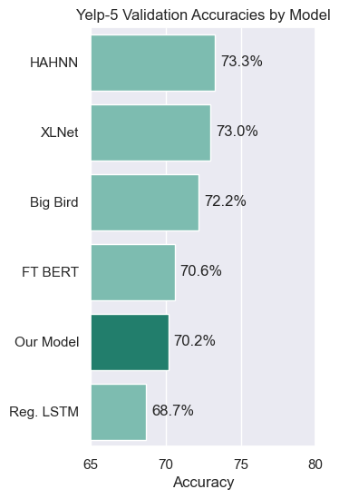
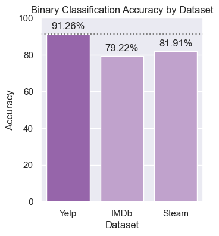
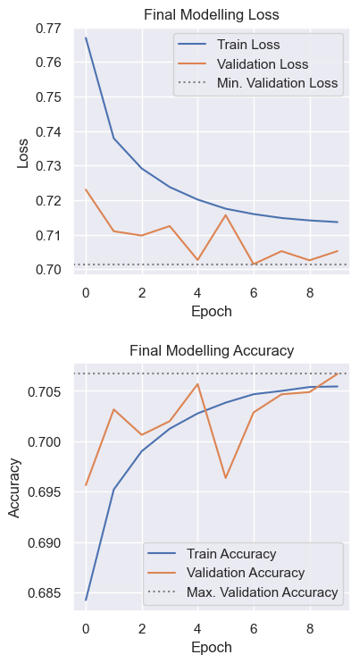
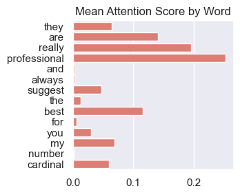

# CS 374: Yelp-5 Sentiment Classification with Self-Attention

An experiment in sentiment classification of the Yelp-5 dataset with
multi-head self-attention and visualizations for explainability.

---

## Data

Datasets include various reviews consisting of natural language.

#### Yelp

The Yelp dataset consists of JSONs with reviews and other metadata concerning businesses, users, etc.

This project uses review text and 5-star ratings exclusively.

* [Dataset](https://www.yelp.com/dataset)
* [Documentation](https://www.yelp.com/dataset/documentation/main)
* See the readme.txt file in *data/yelp* for instructions on data collection.

#### IMDb

50,000 IMDb user reviews with binary sentiment labels.

* [Dataset](https://www.kaggle.com/datasets/lakshmi25npathi/imdb-dataset-of-50k-movie-reviews)
* See the readme.txt file in *data/imdb* for details

#### Steam

Steam reviews with binary sentiment labels.

* [Dataset](https://www.kaggle.com/datasets/andrewmvd/steam-reviews)
* See the readme.txt file in *data/steam* for details

---

## Paper

The final paper describing and visualizing the results of experiments with these datasets is located at the top level: **cs374_final.pdf**

---

## Experiments

Notebooks with training and experiments are in the *experiments* directory.

The results of each experiment are also in this directory, and their use
and visualization may be observed in the notebooks.

---

## Model and Preprocessor

The definitions of ReviewClassifier and ReviewPreprocessor as used in the
experiment notebooks are in *src/model.py* and *src/preprocessor.py*
respectively.

---

## Results

Comparison to other models:

Binary sentiment classification per dataset:

Final model training details:

Example attention score visualization:

These images and more are in the paper!
